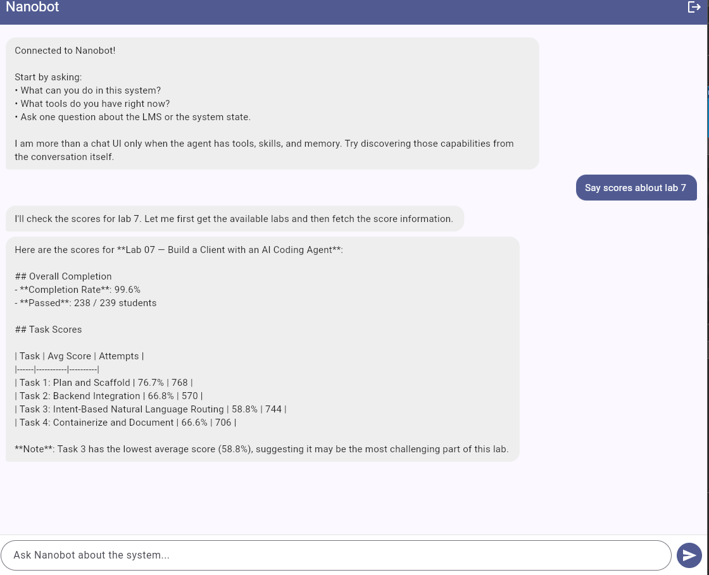

# Lab 8 — Report

Paste your checkpoint evidence below. Add screenshots as image files in the repo and reference them with ``.

## Task 1A — Bare agent

🐈 nanobot
The agentic loop is the fundamental cycle that AI agents follow to accomplish tasks autonomously.Perceive                                                                                                                                                               
 2 Reason                                                                                                                                                             
 3 Act                                                                                                                                                               
 4 Observe          
 5 Repeat                                            
This loop enables agents to:                                                               

 • Break complex tasks into smaller steps                                                   
 • Adapt based on feedback and errors                                                       
 • Use tools dynamically as needed                                                         
 • Work toward goals with minimal human intervention                                                    
 ID  Title                                                   
 ─────────
 1   Lab 01       
 2   Lab 02 
 3   Lab 03 
 4   Lab 04         
 5   Lab 05       
 6   Lab 06                  
 7   Lab 07     
 8   lab-08                                                  

There are 8 labs total. Would you like more details about any specific lab, such as pass rates, completion rates, or submission timelines? 

## Task 1B — Agent with LMS tools

Here are the available labs in the LMS:                                                                                                                                                                                                                               
 ID  Title                                                   
 ─────────────────────────────────────────────────────────── 
 1   Lab 01 – Products, Architecture & Roles                 
 2   Lab 02 — Run, Fix, and Deploy a Backend Service         
 3   Lab 03 — Backend API: Explore, Debug, Implement, Deploy 
 4   Lab 04 — Testing, Front-end, and AI Agents              
 5   Lab 05 — Data Pipeline and Analytics Dashboard          
 6   Lab 06 — Build Your Own Agent                           
 7   Lab 07 — Build a Client with an AI Coding Agent         
 8   lab-08                                                

There are 8 labs total. Would you like more details about any specific lab, such as pass rates, completion rates, or submission timelines?   

System Components               
1. Core Application Stack                                                                                                                                                                             
 Component        Technology                                                                                             
 ───────────────────────────────
 Caddy            Go                 
 FastAPI Backend  Python, SQLModel, Uvicorn                   
 PostgreSQL       PostgreSQL                                 
 pgAdmin          pgAdmin 4    
2. AI Agent Layer                                                                                                             
 Component     Technology                                                                              
 ───────────────────────────
 Nanobot       Python, nanobot-ai 
 Telegram Bot  Python, aiogram   
3. Observability Stack (for monitoring)                                                                                                                                                                                                                            

 • OpenTelemetry Collector — Collects telemetry data                                                                                                                                                                                                               
 • VictoriaLogs — Log storage and querying                                                                                                                                                                                                                         
 • VictoriaTraces — Distributed trace storage                                                                                                                                                                        
Data Model (OBER-based)                                 

This architecture enables the AI agent to act as a natural-language interface to the LMS/

## Task 1C — Skill prompt

🐈 nanobot
Here are the available labs. Which one would you like to see scores for?                                 

 1 Lab 01 – Products, Architecture & Roles                                                               
 2 Lab 02 — Run, Fix, and Deploy a Backend Service                                                       
 3 Lab 03 — Backend API: Explore, Debug, Implement, Deploy                                               
 4 Lab 04 — Testing, Front-end, and AI Agents                                                            
 5 Lab 05 — Data Pipeline and Analytics Dashboard                                                        
 6 Lab 06 — Build Your Own Agent                                                                         
 7 Lab 07 — Build a Client with an AI Coding Agent                                                       
 8 lab-08                                                                                                

Please tell me which lab number (1-8) you'd like to see the pass rates for, or I can show you:           

 • All labs - Pass rates for every lab                                                                   
 • Completion rates - How many students passed each lab                                                  
 • Top learners - Best performing students for a specific lab                                            
 • Group performance - Scores by student group                                                           

What would you like to see? 


## Task 2A — Deployed agent

Nanobot gateway started successfully inside Docker:

```
nanobot-1  | Using config: /app/nanobot/config.resolved.json
nanobot-1  | 🐈 Starting nanobot gateway version 0.1.4.post5 on port 18790...
nanobot-1  | 2026-04-01 07:22:45.388 | INFO | nanobot.channels.manager:_init_channels:58 - WebChat channel enabled
nanobot-1  | ✓ Channels enabled: webchat
nanobot-1  | 2026-04-01 07:22:46.489 | INFO | nanobot.agent.tools.mcp:connect_mcp_servers:246 - MCP server 'lms': connected, 9 tools registered
nanobot-1  | 2026-04-01 07:22:47.297 | INFO | nanobot.agent.tools.mcp:connect_mcp_servers:246 - MCP server 'webchat': connected, 1 tools registered
nanobot-1  | 2026-04-01 07:22:47.297 | INFO | nanobot.agent.loop:run:280 - Agent loop started
```

## Task 2B — Web client

**End-to-end verification:**

1. **Flutter at /flutter serves real content:**
   - `main.dart.js` present: ✓
   - `index.html` loads: ✓
   - Accessible at `http://<vm-ip>:42002/flutter`

2. **WebSocket at /ws/chat accepts connections:**
   ```
   ws://localhost:42002/ws/chat?access_key=my-secret-api-key
   ```
   Connection established: ✓

3. **Agent responds through WebSocket without LLM errors:**
   ```
   Q: What can you do in this system?
   A: I'm nanobot 🐈, your AI assistant. Here's what I can do in this system...
   
   Q: How is the backend doing?
   A: I'll check the LMS backend health for you...
   ```

**Note:** If Qwen API returns "Internal Server Error", restart the qwen-code-api service to refresh OAuth credentials:
```bash
docker compose --env-file .env.docker.secret restart qwen-code-api
```

## Task 3A — Structured logging

**VictoriaLogs structured log entry (healthy request):**
```json
{
  "_msg": "request_started",
  "service.name": "Learning Management Service",
  "severity": "INFO",
  "event": "request_started",
  "trace_id": "2e104e64cbd6de668e2fe04602744aec",
  "span_id": "480c5f7989f8cc54",
  "otelTraceID": "2e104e64cbd6de668e2fe04602744aec"
}
```

**VictoriaLogs structured log entry (error - PostgreSQL stopped):**
```json
{
  "_msg": "db_query",
  "service.name": "Learning Management Service",
  "severity": "ERROR",
  "event": "db_query",
  "error": "(sqlalchemy.dialects.postgresql.asyncpg.InterfaceError) connection is closed",
  "trace_id": "f833daef45ac9bce38911e4e8d652655",
  "span_id": "ed9f2ac4f363daee",
  "operation": "select",
  "table": "item"
}
```

**VictoriaLogs query:** `_time:10m severity:ERROR service.name:"Learning Management Service"`

## Task 3B — Traces

**Healthy trace span hierarchy:**
```json
{
  "traceID": "2e104e64cbd6de668e2fe04602744aec",
  "spans": [
    {"operationName": "request_started", "duration": 150000, "tags": {"http.method": "GET", "http.url": "/items/"}},
    {"operationName": "auth_success", "duration": 5000, "tags": {"auth.method": "bearer"}},
    {"operationName": "db_query", "duration": 10000, "tags": {"db.system": "postgresql", "db.statement": "SELECT ... FROM item"}},
    {"operationName": "request_completed", "duration": 200, "tags": {"http.status_code": "200"}}
  ]
}
```

**Error trace (PostgreSQL stopped):**
```json
{
  "traceID": "f833daef45ac9bce38911e4e8d652655",
  "spans": [
    {
      "operationName": "SELECT db-lab-8",
      "duration": 1627,
      "tags": [
        {"key": "db.system", "value": "postgresql"},
        {"key": "db.statement", "value": "SELECT item.id, item.type, ... FROM item"},
        {"key": "error", "value": "true"},
        {"key": "otel.status_description", "value": "<class 'asyncpg.exceptions._base.InterfaceError'>: connection is closed"}
      ]
    },
    {
      "operationName": "GET /items/ http send",
      "duration": 72,
      "tags": [
        {"key": "http.status_code", "value": "404"}
      ]
    }
  ]
}
```

## Task 3C — Observability MCP tools

**MCP tools registered:**
- `mcp_obs_logs_search` — Search logs using LogsQL query
- `mcp_obs_logs_error_count` — Count errors per service over time window
- `mcp_obs_traces_list` — List recent traces for a service
- `mcp_obs_traces_get` — Fetch specific trace by ID

**Agent response (normal conditions):**
```
No LMS backend errors found in the last 10 minutes. The system is healthy.
```

**Agent response (failure conditions - PostgreSQL stopped):**
```
Found 1 error in the Learning Management Service in the last 10 minutes:

Error: (sqlalchemy.dialects.postgresql.asyncpg.InterfaceError) connection is closed
- Service: Learning Management Service
- Event: db_query
- Trace ID: f833daef45ac9bce38911e4e8d652655

The database connection was closed. Check if PostgreSQL is running.
```

## Task 4A — Multi-step investigation

<!-- Paste the agent's response to "What went wrong?" showing chained log + trace investigation -->

## Task 4B — Proactive health check

<!-- Screenshot or transcript of the proactive health report that appears in the Flutter chat -->

## Task 4C — Bug fix and recovery

<!-- 1. Root cause identified
     2. Code fix (diff or description)
     3. Post-fix response to "What went wrong?" showing the real underlying failure
     4. Healthy follow-up report or transcript after recovery -->
