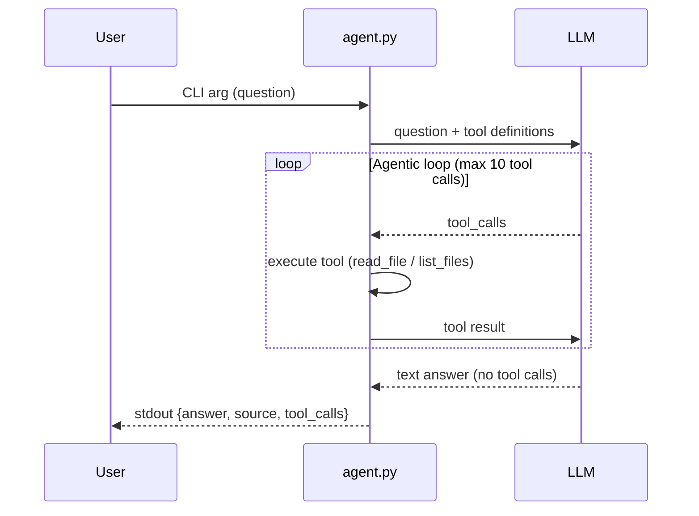

# The Documentation Agent

In Task 1 you built a CLI that calls an LLM, but it still cannot look at your actual code or read your documentation. That is the difference between a chatbot and an **agent**: an agent has **tools** — functions it can call to interact with the real world, then reason about the results. We'll start by giving your agent two tools (`read_file`, `list_files`) to navigate the project wiki.

## You will build the agentic loop 🤖

An agentic loop: your code sends the question to the LLM, the LLM decides which tool to call, your code executes it, feeds the result back, and the LLM decides what to do next — call another tool or give the final answer.



1. Send the user's question + tool definitions to the LLM.
2. If the LLM responds with `tool_calls` → execute each tool, append results as `tool` role messages, go to step 1.
3. If the LLM responds with a text message (no tool calls) → that's the final answer. Extract the answer and source, output JSON and exit.
4. If you hit 10 tool calls → stop looping, use whatever answer you have.

Your system prompt should tell the LLM to use `list_files` to discover wiki files, then `read_file` to find the answer, and include the source reference (file path + section anchor).

## CLI interface

Same rules as Task 1. Two additions: `source` field and populated `tool_calls`.

```bash
uv run agent.py "How do you resolve a merge conflict?"
```

```json
{
  "answer": "Edit the conflicting file, choose which changes to keep, then stage and commit.",
  "source": "wiki/git-workflow.md#resolving-merge-conflicts",
  "tool_calls": [
    {"tool": "list_files", "args": {"path": "wiki"}, "result": "git-workflow.md\n..."},
    {"tool": "read_file", "args": {"path": "wiki/git-workflow.md"}, "result": "..."}
  ]
}
```

- `source` (string, required) — the wiki section reference (e.g., `wiki/git-workflow.md#resolving-merge-conflicts`).
- `tool_calls` (array, required) — all tool calls made. Each entry has `tool`, `args`, and `result`.
- Maximum 10 tool calls per question.

## Required tools

Implement two tools and register them as function-calling schemas in your LLM request.

### `read_file`

Read a file from the project repository.

- **Parameters:** `path` (string) — relative path from project root.
- **Returns:** file contents as a string, or an error message if the file doesn't exist.
- **Security:** must not read files outside the project directory (no `../` traversal).

### `list_files`

List files and directories at a given path.

- **Parameters:** `path` (string) — relative directory path from project root.
- **Returns:** newline-separated listing of entries.
- **Security:** must not list directories outside the project directory.

## Deliverables

### 1. Plan (`plans/task-2.md`)

Before writing code, create `plans/task-2.md`. Describe how you will define tool schemas, implement the agentic loop, and handle path security.

### 2. Tools and agentic loop (update `agent.py`)

Update `agent.py` to define `read_file` and `list_files` as function-calling schemas, implement the agentic loop, and return JSON with `answer`, `source`, and `tool_calls` fields.

### 3. Documentation (update `AGENT.md`)

Update `AGENT.md` to document the tools, the agentic loop, and your system prompt strategy.

### 4. Tests (2 more tests)

Add 2 regression tests for the documentation agent. Example questions:

- `"How do you resolve a merge conflict?"` → expects `read_file` in tool_calls, `wiki/git-workflow.md` in source.
- `"What files are in the wiki?"` → expects `list_files` in tool_calls.

## Acceptance criteria

- [ ] `plans/task-2.md` exists with the implementation plan (committed before code).
- [ ] `agent.py` defines `read_file` and `list_files` as tool schemas.
- [ ] The agentic loop executes tool calls and feeds results back to the LLM.
- [ ] `tool_calls` in the output is populated when tools are used.
- [ ] The `source` field correctly identifies the wiki section that answers the question.
- [ ] Tools do not access files outside the project directory.
- [ ] `AGENT.md` documents the tools and agentic loop.
- [ ] 2 tool-calling regression tests exist and pass.
- [ ] [Git workflow](../../../wiki/git-workflow.md): issue `[Task] The Documentation Agent`, branch, PR with `Closes #...`, partner approval, merge.
