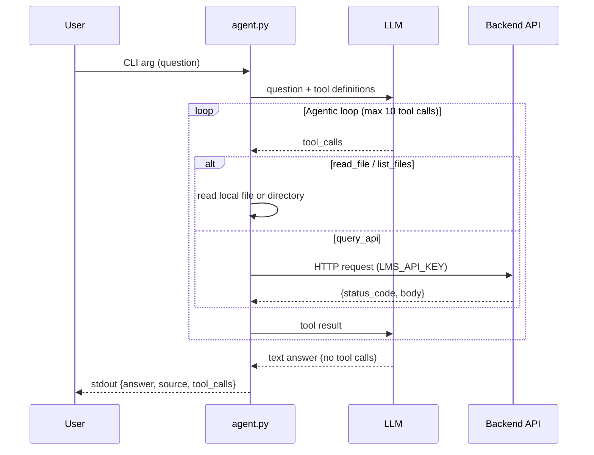

# The System Agent

In Task 2 you built an agent that reads documentation. But documentation can be outdated — the real system is the source of truth. In this task you will give your agent a new tool (`query_api`) so it can talk to your deployed backend, and teach it to answer two new kinds of questions: static system facts (framework, ports, status codes) and data-dependent queries (item count, scores).

## What you will add

You will add a `query_api` tool to the agent you built in Task 2. The agentic loop stays the same — you are just adding one more tool the LLM can call. The agent can now send requests to your deployed backend in addition to reading files.



## CLI interface

Same rules as Task 2. The only change: `source` is now optional (system questions may not have a wiki source).

```bash
uv run agent.py "How many items are in the database?"
```

```json
{
  "answer": "There are 120 items in the database.",
  "tool_calls": [
    {"tool": "query_api", "args": {"method": "GET", "path": "/items/"}, "result": "{\"status_code\": 200, ...}"}
  ]
}
```

## New tool: `query_api`

Call your deployed backend API. Register it as a function-calling schema alongside your existing tools.

- **Parameters:** `method` (string — GET, POST, etc.), `path` (string — e.g., `/items/`), `body` (string, optional — JSON request body).
- **Returns:** JSON string with `status_code` and `body`.
- **Authentication:** use `LMS_API_KEY` from `.env.docker.secret` (the backend key, not the LLM key).

Update your system prompt so the LLM knows when to use wiki tools vs `query_api` vs `read_file` on source code.

> **Note:** Two distinct keys: `LMS_API_KEY` (in `.env.docker.secret`) protects your backend endpoints. `LLM_API_KEY` (in `.env.agent.secret`) authenticates with your LLM provider. Don't mix them up.

## Environment variables

Your agent must read all configuration from **environment variables**, not hardcoded values. The `.env.agent.secret` and `.env.docker.secret` files are local conveniences — the autochecker will inject its own values when evaluating your agent.

| Variable             | Purpose                                                      | Source                          |
| -------------------- | ------------------------------------------------------------ | ------------------------------- |
| `LLM_API_KEY`        | LLM provider API key                                         | `.env.agent.secret`             |
| `LLM_API_BASE`       | LLM API endpoint URL                                         | `.env.agent.secret`             |
| `LLM_MODEL`          | Model name                                                   | `.env.agent.secret`             |
| `LMS_API_KEY`        | Backend API key for `query_api` auth                         | `.env.docker.secret`            |
| `AGENT_API_BASE_URL` | Base URL for `query_api` (default: `http://localhost:42002`) | Optional, defaults to localhost |

> [!IMPORTANT]
> The autochecker runs your agent with different LLM credentials and a different backend URL. If you hardcode any of these values, your agent will fail the autochecker evaluation.

## Pass the benchmark

Once `query_api` works, run the evaluation benchmark locally and iterate until your agent passes.

```bash
uv run run_eval.py
```

The script runs your agent against 10 local questions across all classes (wiki lookup, system facts, data queries, bug diagnosis, reasoning). On failure it shows a feedback hint.

```
  ✓ [1/10] According to the project wiki, what steps are needed to protect a branch?
  ✓ [2/10] What Python web framework does this project use?
  ✓ [3/10] How many items are in the database?

  ✗ [4/10] Query the /analytics/completion-rate endpoint for lab-99...
    feedback: Try GET /analytics/completion-rate?lab=lab-99. Read the error, then find the buggy line.

3/10 passed
```

Fix the failing question, re-run, move on to the next one.

### Benchmark questions (open set)

These are the 10 questions `run_eval.py` tests locally. There are two grading modes:

- **Keyword match** — the answer must contain one or more of the listed keywords.
- **LLM judge** — the autochecker sends your answer to an LLM grader with a rubric. Used for open-ended reasoning questions where keywords alone are not enough. `run_eval.py` falls back to a basic length check locally; the bot uses the full LLM judge.

Your agent must also use the listed tool(s) — calling the wrong tool fails the check even if the answer text is correct.

| # | Question | Grading | Expected | Tools required |
|---|----------|---------|----------|----------------|
| 0 | According to the project wiki, what steps are needed to protect a branch on GitHub? | keyword | `branch`, `protect` | `read_file` |
| 1 | What does the project wiki say about connecting to your VM via SSH? Summarize the key steps. | keyword | `ssh` / `key` / `connect` | `read_file` |
| 2 | What Python web framework does this project's backend use? Read the source code to find out. | keyword | `FastAPI` | `read_file` |
| 3 | List all API router modules in the backend. What domain does each one handle? | keyword | `items`, `interactions`, `analytics`, `pipeline` | `list_files` |
| 4 | How many items are currently stored in the database? Query the running API to find out. | keyword | a number > 0 | `query_api` |
| 5 | What HTTP status code does the API return when you request `/items/` without an authentication header? | keyword | `401` / `403` | `query_api` |
| 6 | Query `/analytics/completion-rate` for a lab with no data (e.g., `lab-99`). What error do you get, and what is the bug in the source code? | keyword | `ZeroDivisionError` / `division by zero` | `query_api`, `read_file` |
| 7 | The `/analytics/top-learners` endpoint crashes for some labs. Query it, find the error, and read the source code to explain what went wrong. | keyword | `TypeError` / `None` / `NoneType` / `sorted` | `query_api`, `read_file` |
| 8 | Read `docker-compose.yml` and the backend `Dockerfile`. Explain the full journey of an HTTP request from the browser to the database and back. | **LLM judge** | must trace ≥4 hops: Caddy → FastAPI → auth → router → ORM → PostgreSQL | `read_file` |
| 9 | Read the ETL pipeline code. Explain how it ensures idempotency — what happens if the same data is loaded twice? | **LLM judge** | must identify the `external_id` check and explain that duplicates are skipped | `read_file` |

> [!NOTE]
> The autochecker tests your agent with 10 additional hidden questions not present in `run_eval.py`. These include multi-step challenges that require chaining tools (e.g., query an API error, then read the source code to diagnose the bug). You need a genuinely working agent — not hard-coded answers.

> [!NOTE]
> **How the autochecker scores your agent:**
>
> - Locally, `run_eval.py` checks answers with simple keyword matching.
> - The autochecker bot uses the same keyword checks, but for open-ended reasoning questions (e.g., "explain the request lifecycle") it uses **LLM-based judging** with a rubric — a stricter and more accurate evaluation.
> - The bot also verifies that your agent used the **correct tools** (e.g., `query_api` for data questions, `read_file` for code questions).
> - You need to pass a minimum threshold overall (local + hidden questions combined).

### Debugging workflow

| Symptom                                         | Likely cause                                                    | Fix                                                                                                                 |
| ----------------------------------------------- | --------------------------------------------------------------- | ------------------------------------------------------------------------------------------------------------------- |
| Agent doesn't use a tool when it should         | Tool description too vague for the LLM                          | Improve the tool's description in the schema                                                                        |
| Tool called but returns an error                | Bug in tool implementation                                      | Fix the tool code, test it in isolation                                                                             |
| Tool called with wrong arguments                | LLM misunderstands the schema                                   | Clarify parameter descriptions                                                                                      |
| Agent times out                                 | Too many tool calls or slow LLM                                 | Reduce max iterations, try a faster model                                                                           |
| Agent crashes with `AttributeError: 'NoneType'` | LLM returns `content: null` when it makes tool calls            | Use `(msg.get("content") or "")` instead of `msg.get("content", "")` — the field is present but `null`, not missing |
| Agent reads the same file in a loop             | File is too large and gets truncated, LLM can't find the answer | Increase the content limit sent back to the LLM                                                                     |
| Answer is close but doesn't match               | Phrasing doesn't contain expected keyword                       | Adjust system prompt to be more precise                                                                             |

## Deliverables

### 1. Plan (`plans/task-3.md`)

Before writing code, create `plans/task-3.md`. Describe how you will define the `query_api` tool schema, handle authentication, and update the system prompt.

After running the benchmark once, add your initial score, first failures, and iteration strategy.

### 2. Tool and agent updates (update `agent.py`)

Add `query_api` as a function-calling schema, implement it with authentication, and update the system prompt. Then iterate until the benchmark passes.

### 3. Documentation (update `AGENT.md`)

Update `AGENT.md` to document the `query_api` tool, its authentication, how the LLM decides between wiki and system tools, lessons learned from the benchmark, and your final eval score. At least 200 words.

### 4. Tests (2 more tests)

Add 2 regression tests for system agent tools. Example questions:

- `"What framework does the backend use?"` → expects `read_file` in tool_calls.
- `"How many items are in the database?"` → expects `query_api` in tool_calls.

## Acceptance criteria

- [ ] `plans/task-3.md` exists with the implementation plan and benchmark diagnosis.
- [ ] `agent.py` defines `query_api` as a function-calling schema.
- [ ] `query_api` authenticates with `LMS_API_KEY` from environment variables.
- [ ] The agent reads all LLM config (`LLM_API_KEY`, `LLM_API_BASE`, `LLM_MODEL`) from environment variables.
- [ ] The agent reads `AGENT_API_BASE_URL` from environment variables (defaults to `http://localhost:42002`).
- [ ] The agent answers static system questions correctly (framework, ports, status codes).
- [ ] The agent answers data-dependent questions with plausible values.
- [ ] `run_eval.py` passes all 10 local questions.
- [ ] `AGENT.md` documents the final architecture and lessons learned (at least 200 words).
- [ ] 2 tool-calling regression tests exist and pass.
- [ ] The agent passes the autochecker bot benchmark.
- [ ] [Git workflow](../../../wiki/git-workflow.md): issue `[Task] The System Agent`, branch, PR with `Closes #...`, partner approval, merge.
